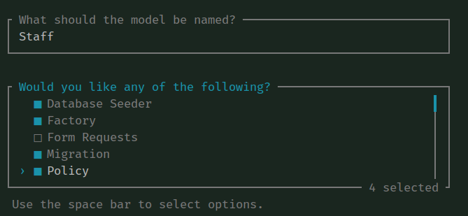

## Seeder
 
- Add **'is_active'** field to the User with a migration 

````bash
php artisan make:migration alterUsers
````
- at alter user 
````php
Schema::table('users', function (Blueprint $table) {
    $table->boolean('is_active')->default(false)->after('email');  //for migrate
});

Schema::table('users', function (Blueprint $table) {
    $table->dropColumn('is_active');                                //for reverse migrate
});
// Add to the protected array in model and also add to the UserResource

````
- Create separate Seeder files for the APP that way you can run them independently

````bash
php artisan make:seeder RoleSeeder
php artisan make:seeder PermissionSeeder
php artisan make:seeder ApplicationSeeder
php artisan make:seeder UserSeeder
````

- Update the DatabaseSeeder as follows and paste $user login details as well as userasign roles line28

````php
public function run()
{
    $this->call([
        RoleSeeder::class,
        PermissionSeeder::class,
        ApplicationSeeder::class,
        UserSeeder::class,
    ]);
}
````

### RoleSeeder

````php
public function run()
{
    DB::update('SET FOREIGN_KEY_CHECKS = ?', [0]);
    DB::update('TRUNCATE TABLE roles');
    DB::update('SET FOREIGN_KEY_CHECKS = ?', [1]);
    $roles = ['Superuser', 'Admin', 'Manager', 'Staff', 'Client'];
    foreach ($roles as $role) {
        Role::create(['name' => $role]);
    }
}
````
## PermissionSeeder

- Add role const in User model to use below

````php
// in User.php place above protected $fillable
const SUPERUSER = 'Superuser';
const ADMIN = 'Admin';
const MANAGER = 'Manager';
const STAFF = 'Staff';
const CLIENT = 'Client';
````

- Start with the base and come back and extend this as the APP develops

````php
public function run()
{
    DB::update('SET FOREIGN_KEY_CHECKS = ?', [0]);
    DB::update('TRUNCATE TABLE permissions');
    DB::update('TRUNCATE TABLE role_has_permissions');
    DB::update('TRUNCATE TABLE model_has_permissions');
    DB::update('SET FOREIGN_KEY_CHECKS = ?', [1]);

    $models = [
        'users' => ['list', 'view', 'create', 'update', 'delete', 'restore', 'destroy', 'activities', 'updatePassword', 'impersonate'],
        'roles' => ['list', 'view', 'create', 'update', 'delete', 'restore', 'destroy'],
        'permissions' => ['list', 'view', 'create', 'update', 'delete', 'restore', 'destroy'],
        'provinces' => ['list', 'view', 'create', 'update', 'delete', 'restore', 'destroy'],
        'cities' => ['list', 'view', 'create', 'update', 'delete', 'restore', 'destroy', 'activities'],
        'owners' => ['list', 'view', 'create', 'update', 'delete', 'restore', 'destroy', 'activities'],
        'stores' => ['list', 'view', 'create', 'update', 'delete', 'restore', 'destroy', 'activities'],
    ];

    $adminPermissions = [
        'users' => ['list', 'view', 'create', 'update', 'delete', 'restore', 'activities'],
        'roles' => ['list', 'view'],
        'permissions' => ['list', 'view'],
        'provinces' => ['list', 'view'],
        'cities' => ['list', 'view', 'create', 'update', 'delete', 'restore', 'activities'],
        'owners' => ['list', 'view', 'create', 'update', 'delete', 'restore', 'activities'],
        'stores' => ['list', 'view', 'create', 'update', 'delete', 'restore', 'activities'],
    ];

    $managerPermissions = [
        'stores' => ['list', 'view', 'update'],
    ];

    $staffPermissions = [
        'stores' => ['list', 'view'],
    ];

    foreach ($models as $model => $permissions) {
        foreach ($permissions as $permission) {
            Permission::create(['name' => $model.'.'.$permission]);
        }
    }

    $adminRole = Role::where('name', 'Admin')->first();
    foreach ($adminPermissions as $model => $permissions) {
        foreach ($permissions as $permission) {
            $adminRole->givePermissionTo($model.'.'.$permission);
        }
    }

    // Setup Manager role permissions.
    $managerRole = Role::where('name', 'Manager')->first();
    foreach ($managerPermissions as $model => $permissions) {
        foreach ($permissions as $permission) {
            $managerRole->givePermissionTo($model.'.'.$permission);
        }
    }
    // Setup Staff role permissions.
    $staffRole = Role::where('name', 'Staff')->first();
    foreach ($staffPermissions as $model => $permissions) {
        foreach ($permissions as $permission) {
            $staffRole->givePermissionTo($model.'.'.$permission);
        }
    }
}
````

## Spatie Permission already exists ERROR

````bash
sudo php artisan permission:cache-reset
````

## ApplicationSeeder

- We added **Provinces, Cities, Owners & Stores** in the permissions
- To use these add all 4 Models 
- **NB: do the protected $fillable[]**
- After the migration/seed we will then add the Filament Resources

**Best Practice**

````bash
php artisan make:model
````

- When prompted enter the model name and then choose 
  - Seeder
  - Factory
  - Migration
  - Policy



- Edit the migrations, ie create the table schema

````php
- for activity
 public function up(): void
    {
        Schema::create('blogs', function (Blueprint $table) {
            $table->id();
            $table->integer('writer_id');
            $table->string('name');
            $table->string('slug')->unique();
            $table->text('intro');
            $table->text('content');
            $table->string('photo');
            $table->timestamps();
            $table->softDeletes();
        });


..........
Schema::create('provinces', function (Blueprint $table) {
    $table->id();
    $table->string('name');
    $table->timestamps();
    $table->softDeletes();
});

Schema::create('cities', function (Blueprint $table) {
    $table->id();
    $table->string('name');
    $table->decimal('latitude', 8, 4);
    $table->decimal('longitude', 8, 4);
    $table->unsignedBigInteger('province_id');
    $table->timestamps();
    $table->softDeletes();
});

Schema::create('owners', function (Blueprint $table) {
    $table->id();
    $table->string('name');
    $table->string('slug');
    $table->string('contact');
    $table->string('phone');
    $table->string('email');
    $table->string('logo')->nullable();
    $table->string('image')->nullable();
    $table->timestamps();
    $table->softDeletes();
});

Schema::create('stores', function (Blueprint $table) {
    $table->id();
    $table->string('name');
    $table->string('slug');
    $table->string('contact');
    $table->string('phone');
    $table->string('email');
    $table->integer('owner_id')->nullable();
    $table->integer('province_id')->nullable();
    $table->integer('city_id')->nullable();
    $table->text('address')->nullable();
    $table->string('zip_code')->nullable();
    $table->string('sms_user')->nullable();
    $table->string('sms_password')->nullable();
    $table->string('logo')->nullable();
    $table->string('image')->nullable();
    $table->timestamps();
    $table->softDeletes();
});
````

- create directory source in project and use the [cities](ttps://simplemaps.com/data/za-cities)

````php
$provinces = ['Eastern Cape' => 0, 'Free State' => 0, 'Gauteng' => 0, 'KwaZulu-Natal' => 0, 'Limpopo' => 0, 'Mpumalanga' => 0, 'Northern Cape' => 0, 'North West' => 0, 'Western Cape' => 0];

foreach ($provinces as $province => $id) {
    $p = Province::firstOrCreate(['name' => $province]);
    $provinces[$province] = $p->id;
}
 
$cities = json_decode(file_get_contents(base_path('source/za-cities.json')), JSON_OBJECT_AS_ARRAY);
foreach ($cities as $city) {
    City::firstOrCreate([
        'name'        => $city['city'],
        'province_id' => $provinces[$city['admin_name']],
        'latitude'    => $city['lat'],
        'longitude'   => $city['lng'],
    ]);
}
````

### UserSeeder

````php
// create a user for each backoffice role exlcuding Client, example:
$user1 = User::create([
    'name'                => 'Naude',
    'email'               => 'naude@carsalesportal.co.za',
    'password'            => bcrypt('password'),
    'email_verified_at'   => Carbon::now(),
    'is_active'           => 'true',
]);
...
$user4 = User::create([
    'name'                => 'Staff',
    'email'               => 'staff@carsalesportal.co.za',
    'password'            => bcrypt('password'),
    'email_verified_at'   => Carbon::now(),
    'is_active'           => 'true',
]);

// then add the role to the user
$user1->assignRole(User::SUPERUSER);
...
$user4->assignRole(User::STAFF);

````

- Migrate and reseed again - should actually do/test this often as the APP grows

````bash
php artisan migrate:refresh --seed
````

- The above runs 3 x commands

````bash
php artisan migrate:reset     # rollback all migrations
php artisan migrate           # run migrations
php artisan db:seed           # run seeders
````

- Login to Mysql and see the fresh migrations and seeds

## Use Factory and Faker to generate sample Owners and Stores 

- Check the factory files exist if not create them manually
  - Set the default values the seeder with faker will use
  - 'is_active' => true

````bash
php artisan make:factory StoreFactory
````

- List of Faker options
  ```
  ['Address', 'Barcode', 'Biased', 'Color', 'Company', 'DateTime', 'File',
   'HtmlLorem', 'Image', 'Internet', 'Lorem', 'Medical',    'Miscellaneous',
   'Payment', 'Person', 'PhoneNumber', 'Text', 'UserAgent']
  ```

- **OwnerFactory**

````php
$company = fake()->company();
return [
    'name' => $company,
    'slug' => Str::slug($company),
    'contact' => fake()->lastName(),
    'phone' => fake()->phoneNumber(),
    'email' => fake()->companyEmail(),
    'image' => fake()->imageUrl,
];
````

- **StoreFactory**

````php
$owners = Owner::select('id')->get();
$city = City::inRandomOrder()->limit(1)->first();
$name = fake()->company();
return [
    'name' => $name,
    'slug' => Str::slug($name),
    'contact' => fake()->lastName(),
    'phone' => fake()->phoneNumber(),
    'email' => fake()->safeEmail(),
    'owner_id' => fake()->shuffle(array($owners)),
    'province_id' => $city->province_id,
    'city_id' => $city->id,
    'address' => fake()->address(),
    'zip_code' => fake()->randomDigit(4),
    'logo' => fake()->imageUrl,
    'image' => fake()->imageUrl,
];
````
- in filament resource create resource page
````
php artisan make:filament-resource Writer --generate --view

- In the ApplicationSeeder call the Factory which invokes the faker 
````php
\App\Models\Store::factory(40)->create();
````

- Login to app, nothing much changed we need to add the 4 x new Resources
